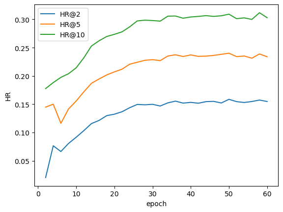
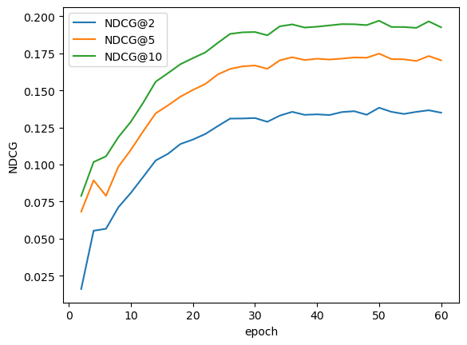
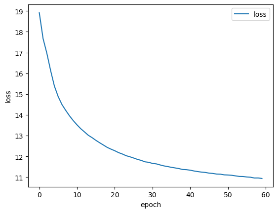
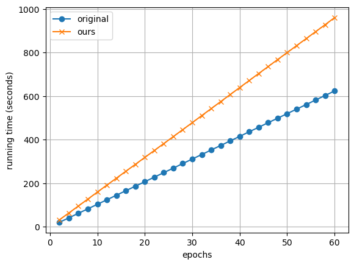

# EECS6322 Reproducibility Project
This reproducibility task follows the work of Wang et al.of __Adaptive Graph Representation Learning for Next POI Recommendation__ [1].

Our reproducibility attempts are the following files:
* Attention.py
* GCN.py
* main.py
* preprocess.py
* utils.py
* plot_runtime.py

The remaining files are from the original GitHub repository. In the end, we onlu use _Attention.py_ and _GCN.py_ 
for our implementation. We use the original code to test our implementation and how it affects the original model.

The dataset is taken from [here](https://github.com/wangzb11/AGRAN) located in 
"datasets/foursquare_given" for the Foursquare dataset. 


To run the code:
```commandline
python authors_main.py --device cuda:0 --num_epochs 60
```
The experimental results are as follows:
#### Recall@_k_ for k={2,5,10}


#### NDCG@_k_ for k={2,5,10}


#### Loss per epoch



We used the runtime results for our implementation method and the [original code](https://github.com/wangzb11/AGRAN) , 
to further plot the running time of each approach with plot_runtime.py. 
#### Loss per epoch


---
[1] Wang, Zhaobo, et al. "Adaptive Graph Representation Learning for Next POI Recommendation." Proceedings of the 46th International ACM SIGIR Conference on Research and Development in Information Retrieval. 2023.

